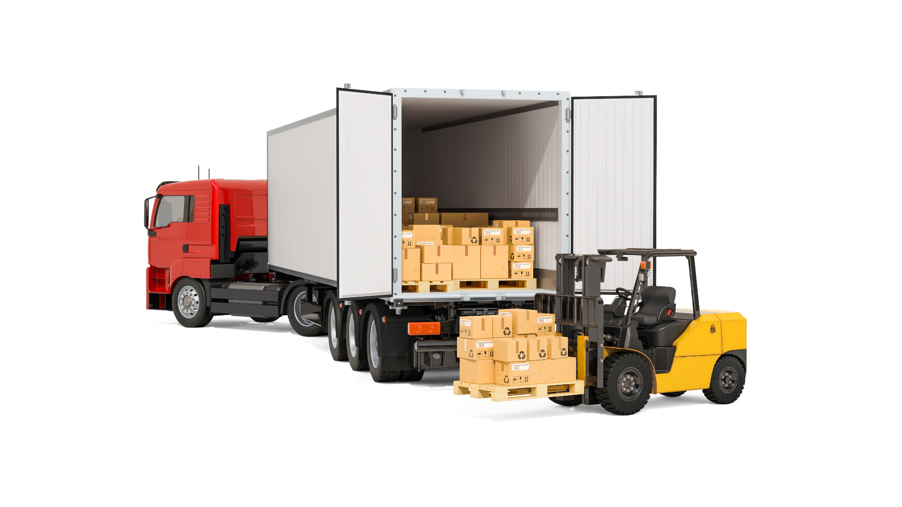

<h1>Hi, I'm Reetu</h1>

<h3>Data Scientist · Experimentation, Causal Inference & ML</h3>

6+ years turning data into pricing, supply chain, and product decisions

  <strong>What should we price?</strong>
  &nbsp;&nbsp; • &nbsp;&nbsp;
  <strong>Where should inventory move?</strong>
  &nbsp;&nbsp; • &nbsp;&nbsp;
  <strong>What should we recommend?</strong>
  &nbsp;&nbsp; • &nbsp;&nbsp;
  <strong>And did it actually work?</strong>

 

&nbsp;
&nbsp;
&nbsp;

<h2>Industry Impact</h2>

<table>
<tr>

<td width="33%" align="center">
  
    
  <strong>Vehicle Pricing</strong>
   
  <strong>↑ ~18% profit per car</strong>
   
  <strong>80% of pricing automated</strong>
    
  Automated pricing for a German automobile client, with the profit lift measured through randomized A/B tests against manual pricing.
</td>

<td width="33%" align="center">
  
    
  <strong>Supply Chain Optimization</strong>
   
  <strong>~4.5% potential cost savings</strong>
   
  <strong>10K–15K transfers/month</strong>
    
  ML decision support for stock-transfer sourcing, saving procurement admins 1.5 hours a day.
</td>

<td width="33%" align="center">
  
    
  <strong>E-commerce Experimentation</strong>
   
  <strong>Email share of sales: 3% → 7%</strong>
   
  <strong>10+ A/B tests per quarter</strong>
    
  Designed and analyzed email experiments, and A/B-tested a cart-abandonment recommender that contributed to ~30% quarter-over-quarter growth in email-attributed sales.
</td>

</tr>
</table>

### 📊 Product & Decision Science

**[Churn Without a Cancel Button](https://github.com/reetu95/Customer-Retention-Segmentation-Uplift)** &nbsp;  

`Randomized holdout → uplift models → budget-constrained targeting → Streamlit app`

Retail customers never click cancel. They just stop coming back, so churn has to be inferred rather than observed. Using a campaign's randomized control group to measure what an offer actually *caused*, the ranking flips depending on what you count. At a 5% budget, targeting by likely response returns **147** extra purchases per 1,000 customers, against **32** for targeting by churn risk. But the keenest responders spend the least, so weighting response by value gives **₽1.24M** incremental revenue against **₽0.27M** (figures in the dataset's currency, Russian rubles). Neither "who is leaving" nor "who responds" is enough on its own.

 

**[→ All Data Science & ML projects](https://github.com/reetu95/projects#-data-science--ml)**

### 🤖 AI & GenAI

**[AI Powered Financial Document Analysis](https://github.com/reetu95/AI-Powered-Financial-Document-Analysis)**

`Financial PDFs → FAISS + BM25 hybrid retrieval → LangGraph agent → Llama 3.1`

An AI system that reads financial reports and answers questions about the numbers inside them, reviewing and correcting its own answers before responding. It scored **41.5% on FinanceBench**, more than double the 19% scored by GPT-4 Turbo.

I also build multi-agent workflows with CrewAI and evaluation harnesses with RAGAS.

**[→ All AI & GenAI projects](https://github.com/reetu95/projects#-ai--genai)**

### 🔬 Research

**[ML Surrogate for Heat Sink Cooling](https://github.com/reetu95/cfd-ml-surrogate-heatsink)** &nbsp; 

`25 OpenFOAM CFD runs → 1.9M mesh samples → PyTorch surrogate → full 3D temperature field in 40 ms`

Thermal design is bottlenecked by simulation: one CFD solve of a pin-fin heat sink takes ~15 minutes, so sweeping 1,000 geometries costs ~250 CPU-hours. A feed-forward network trained on 25 simulations predicts the entire temperature field in **40 ms, a 22,500× speedup**, at **MAE 0.021 K** across 383,138 held-out points.

**Publications**

- **ASME FEDSM 2026** — Machine learning for instant prediction of spatial temperature variations in heat sinks for computer chip cooling (lead author)
- Towards utilizing machine learning and computational fluid dynamics in the classroom for high heat dissipation
- ✍️ [Blog posts on Medium](https://medium.com/@reetuthimmaiah)

**M.S. Computer Science, Rochester Institute of Technology**

### 🛠️ Core Stack

**Experimentation & Analytics**

     

**ML & Modeling**

      

**Data Platforms**

    

**GenAI & LLMs**

     

**Cloud & DevOps**

   

 

📫 Open to <b>Product Data Science & Data Science roles</b> &nbsp;·&nbsp; <a href="mailto:reetu.thimmaiah@gmail.com">reetu.thimmaiah@gmail.com</a>

